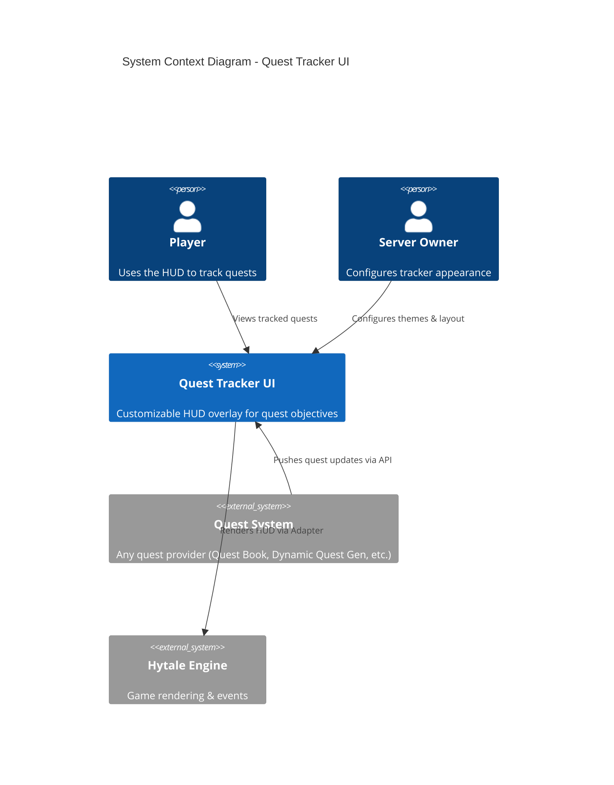
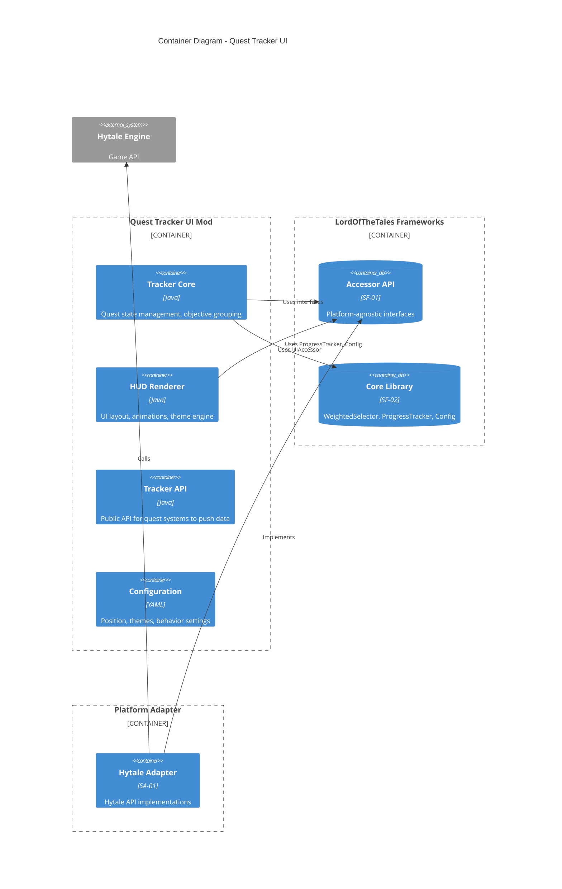
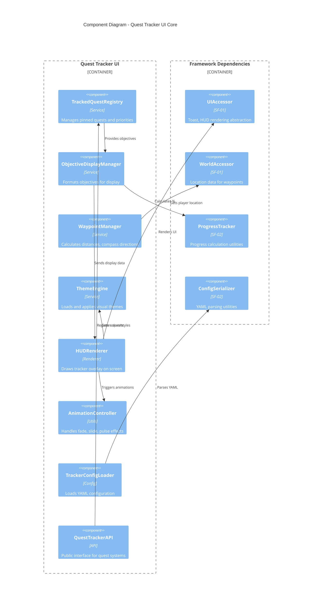

# Standalone Mod: Quest Tracker UI

> A customizable HUD overlay for tracking quests, objectives, and waypoints. Works with any quest system via a simple API. Provides the visual layer without requiring a specific quest backend.

---

## Product Identity

| Attribute | Value |
|-----------|-------|
| **Mod ID** | `quest-tracker-ui` |
| **CurseForge Slug** | `hytale-quest-tracker` |
| **Maven Artifact** | `com.lordofthetales.mod:quest-tracker-ui` |
| **License** | Proprietary (CurseForge monetization) |
| **Monetization** | CurseForge Points + Premium themes |
| **Target Audience** | Server owners, players |
| **Status** | 📋 Spec Ready |

---

## C4 Architecture

### C1: System Context



### C2: Container Diagram



### C3: Component Diagram



---

## Dependency Graph

```
quest-tracker-ui
├── com.lordofthetales.framework:accessor-api (SF-01) ── Interfaces only
├── com.lordofthetales.framework:core-lib (SF-02) ────── ProgressTracker, ConfigSerializer
└── [Runtime] com.lordofthetales.adapter:hytale-adapter (SA-01)
```

### Maven Dependencies

```xml
<dependencies>
    <!-- Framework Dependencies (compile-time) -->
    <dependency>
        <groupId>com.lordofthetales.framework</groupId>
        <artifactId>accessor-api</artifactId>
        <version>${accessor.version}</version>
    </dependency>
    <dependency>
        <groupId>com.lordofthetales.framework</groupId>
        <artifactId>core-lib</artifactId>
        <version>${core.version}</version>
    </dependency>
    
    <!-- Platform Adapter (runtime only - provided by server) -->
    <dependency>
        <groupId>com.lordofthetales.adapter</groupId>
        <artifactId>hytale-adapter</artifactId>
        <version>${adapter.version}</version>
        <scope>runtime</scope>
    </dependency>
</dependencies>
```

---

## Architecture Compliance

### ✅ ZERO Hytale Imports Rule

This mod follows the **Platform Abstraction Layer** pattern:

| Layer | Hytale Imports | Location |
|-------|:-------------:|----------|
| Quest Tracker UI (this mod) | ❌ ZERO | `projects/mods/quest-tracker-ui/` |
| Accessor API (SF-01) | ❌ ZERO | `projects/frameworks/accessor-api/` |
| Core Library (SF-02) | ❌ ZERO | `projects/frameworks/core-lib/` |
| Hytale Adapter (SA-01) | ✅ Allowed | `projects/adapters/hytale-adapter/` |

### Architectural Decision Records

| ID | Decision | Rationale |
|----|----------|-----------|
| **ADR-001** | Use UIAccessor for all rendering | Enables testing without game engine |
| **ADR-002** | Theme system via YAML | Non-coders can create themes |
| **ADR-003** | Push-based API | Quest systems push updates, no polling |
| **ADR-004** | Animation via state machine | Predictable, testable animations |

---

## Specification

---

## Value Proposition

### Problem Statement
- Quest mods often have poor or no UI
- Players lose track of objectives in complex modpacks
- No standardized way to display quest progress on HUD
- Waypoint integration is mod-specific

### Solution
A dedicated, polished quest tracking UI that:
- Displays pinned quests on HUD
- Shows objective progress with visual feedback
- Integrates waypoint markers on compass/map
- Is highly customizable (themes, position, scale)
- Works with ANY quest backend via simple API

---

## Feature Specification

### QT-001: HUD Overlay

```
┌─────────────────────────────────────────────────────┐
│  QUEST TRACKER                              [⚙] [−] │
├─────────────────────────────────────────────────────┤
│  ★ Defeat the Orcs                                  │
│    ├─ ☐ Kill Orc Warriors (7/10)       ████████░░   │
│    ├─ ☑ Find the Orc Camp              ██████████   │
│    └─ ☐ Defeat Orc Captain (0/1)       ░░░░░░░░░░   │
│                                                      │
│  ◆ Gather Herbs                                      │
│    └─ ☐ Collect Athelas (3/10)         ███░░░░░░░   │
│                                                      │
│  ○ Deliver the Message                    ⏱ 12:34   │
│    └─ ☐ Speak to Gandalf                 → 234m     │
└─────────────────────────────────────────────────────┘
```

**Visual Elements:**
| Element | Meaning |
|---------|---------|
| ★ | Main/Primary quest |
| ◆ | Side quest |
| ○ | Timed quest |
| ☑ | Completed objective |
| ☐ | Incomplete objective |
| ████░░ | Progress bar |
| ⏱ | Time remaining |
| → 234m | Distance to waypoint |

### QT-002: Tracker Configuration

```yaml
# quest-tracker-ui.yml
tracker:
  # Position & Layout
  position:
    anchor: TOP_RIGHT      # TOP_LEFT, TOP_RIGHT, BOTTOM_LEFT, BOTTOM_RIGHT, CENTER
    offset_x: -20
    offset_y: 50
  
  size:
    width: 280
    max_height: 400
    scale: 1.0
  
  # Display Settings
  display:
    max_pinned_quests: 3
    max_visible_objectives: 8
    show_completed_objectives: true
    completed_fade_seconds: 3
    show_progress_bars: true
    show_progress_text: true
    show_distance: true
    show_timer: true
    
  # Collapse Behavior
  collapse:
    enabled: true
    default_collapsed: false
    collapse_completed: true
    collapse_during_combat: false
    
  # Animations
  animations:
    enabled: true
    objective_complete_flash: true
    progress_update_pulse: true
    new_quest_slide_in: true
    duration_ms: 300
```

### QT-003: Theme System

```yaml
# themes/dark-fantasy.yml
theme:
  name: "Dark Fantasy"
  author: "LordOfTheTales"
  
  colors:
    background: "#1a1a2e"
    background_opacity: 0.85
    border: "#4a4a6a"
    
    text_primary: "#ffffff"
    text_secondary: "#aaaaaa"
    text_completed: "#666666"
    
    quest_main: "#ffd700"        # Gold
    quest_side: "#87ceeb"        # Light blue
    quest_timed: "#ff6b6b"       # Red
    quest_guild: "#90ee90"       # Light green
    
    progress_fill: "#4caf50"
    progress_background: "#333333"
    progress_complete: "#8bc34a"
    
    timer_normal: "#ffffff"
    timer_warning: "#ffeb3b"     # < 5 min
    timer_critical: "#f44336"    # < 1 min
    
  fonts:
    title: "Minecraft"
    body: "Minecraft"
    size_title: 14
    size_body: 12
    size_small: 10
    
  icons:
    quest_main: "textures/icons/star.png"
    quest_side: "textures/icons/diamond.png"
    quest_timed: "textures/icons/clock.png"
    objective_complete: "textures/icons/check.png"
    objective_incomplete: "textures/icons/square.png"
    waypoint: "textures/icons/arrow.png"
    
  borders:
    style: "rounded"        # none, solid, rounded, fancy
    radius: 4
    width: 1
```

### QT-004: Waypoint Integration

```java
/**
 * Waypoint display for quest objectives.
 */
public class QuestWaypoint {
    private final String id;
    private final Vec3 position;
    private final String label;
    private final WaypointStyle style;
    private final boolean showDistance;
    private final boolean showCompass;
    private final boolean showWorldMarker;
    
    public enum WaypointStyle {
        DEFAULT,        // Standard marker
        OBJECTIVE,      // Objective icon
        NPC,            // NPC head/icon
        LOCATION,       // Location flag
        DANGER          // Skull/warning
    }
}

/**
 * Compass integration - shows waypoints on screen edge.
 */
public class CompassRenderer {
    
    public void render(RenderContext ctx, List<QuestWaypoint> waypoints) {
        for (QuestWaypoint waypoint : waypoints) {
            // Calculate screen position from world position
            Vec2 screenPos = worldToCompass(waypoint.getPosition(), ctx);
            
            // Clamp to screen edge if off-screen
            if (isOffScreen(screenPos)) {
                screenPos = clampToEdge(screenPos, ctx.getScreenSize());
                renderEdgeIndicator(ctx, screenPos, waypoint);
            } else {
                renderWaypointMarker(ctx, screenPos, waypoint);
            }
        }
    }
}
```

### QT-005: Integration API

```java
/**
 * API for quest mods to integrate with the tracker UI.
 * Quest mods implement this data provider.
 */
public interface QuestDataProvider {
    
    /**
     * Get all trackable quests for a player.
     */
    List<TrackedQuest> getTrackedQuests(UUID playerId);
    
    /**
     * Get pinned quests (shown on HUD).
     */
    List<TrackedQuest> getPinnedQuests(UUID playerId);
    
    /**
     * Pin/unpin a quest.
     */
    void setPinned(UUID playerId, String questId, boolean pinned);
    
    /**
     * Get quest details for expanded view.
     */
    QuestDetails getQuestDetails(String questId);
    
    /**
     * Register for real-time updates.
     */
    void addUpdateListener(QuestUpdateListener listener);
}

/**
 * Quest data structure for UI display.
 */
public record TrackedQuest(
    String id,
    String name,
    String description,
    QuestType type,
    List<TrackedObjective> objectives,
    Duration timeRemaining,     // null if no time limit
    boolean isPinned,
    int displayPriority
) {}

public record TrackedObjective(
    String id,
    String description,
    int currentProgress,
    int requiredProgress,
    boolean isComplete,
    QuestWaypoint waypoint      // null if no waypoint
) {}

/**
 * Real-time update events.
 */
public interface QuestUpdateListener {
    void onQuestAdded(UUID playerId, TrackedQuest quest);
    void onQuestRemoved(UUID playerId, String questId);
    void onQuestCompleted(UUID playerId, String questId);
    void onObjectiveUpdated(UUID playerId, String questId, TrackedObjective objective);
    void onObjectiveCompleted(UUID playerId, String questId, String objectiveId);
}
```

### QT-006: Keybindings

```yaml
keybindings:
  toggle_tracker: "K"           # Show/hide tracker
  expand_tracker: "SHIFT+K"     # Expand/collapse details
  cycle_pinned: "TAB"           # Cycle through pinned quests
  open_quest_menu: "J"          # Open full quest list
  track_nearest: "N"            # Pin nearest quest objective
  
  # In quest menu
  pin_quest: "MOUSE_MIDDLE"
  abandon_quest: "DELETE"
  share_quest: "S"
```

### QT-007: Notification System

```java
/**
 * Toast notifications for quest events.
 */
public class QuestNotifications {
    
    public void showQuestAccepted(TrackedQuest quest) {
        Toast.builder()
            .title("Quest Accepted")
            .message(quest.name())
            .icon(getQuestIcon(quest.type()))
            .style(ToastStyle.SUCCESS)
            .duration(3000)
            .sound("quest_accept")
            .show();
    }
    
    public void showObjectiveComplete(TrackedObjective objective) {
        Toast.builder()
            .title("Objective Complete")
            .message(objective.description())
            .icon(Icons.CHECKMARK)
            .style(ToastStyle.SUCCESS)
            .duration(2000)
            .sound("objective_complete")
            .show();
    }
    
    public void showQuestComplete(TrackedQuest quest, List<Reward> rewards) {
        Toast.builder()
            .title("Quest Complete!")
            .message(quest.name())
            .rewards(rewards)
            .icon(Icons.TROPHY)
            .style(ToastStyle.EPIC)
            .duration(5000)
            .sound("quest_complete")
            .confetti(true)
            .show();
    }
    
    public void showTimerWarning(TrackedQuest quest, Duration remaining) {
        Toast.builder()
            .title("Time Running Out!")
            .message(quest.name() + " - " + formatDuration(remaining))
            .icon(Icons.CLOCK)
            .style(ToastStyle.WARNING)
            .duration(3000)
            .sound("timer_warning")
            .show();
    }
}
```

---

## UI Screens

### QT-008: Quest List Screen

Accessed via keybind (default: J) or button in tracker.

```
┌─────────────────────────────────────────────────────────────────┐
│  QUEST LOG                                    [Active] [History]│
├─────────────────────────────────────────────────────────────────┤
│                                                                 │
│  ▼ MAIN STORY (2)                                               │
│    ┌──────────────────────────────────────────────────────────┐ │
│    │ ★ The Road to Rivendell              Lv. 25    📌        │ │
│    │   Journey to the Last Homely House                       │ │
│    │   Progress: 2/4 objectives           ████████░░░░        │ │
│    └──────────────────────────────────────────────────────────┘ │
│    ┌──────────────────────────────────────────────────────────┐ │
│    │ ★ Shadows in the East                Lv. 30              │ │
│    │   Investigate the growing darkness                       │ │
│    │   Progress: 0/3 objectives           ░░░░░░░░░░░░        │ │
│    └──────────────────────────────────────────────────────────┘ │
│                                                                 │
│  ▼ SIDE QUESTS (5)                                              │
│    ◆ Lost Heirloom                        Lv. 20    📌        │ │
│    ◆ Herb Collector                       Lv. 15              │ │
│    ◆ Wolf Problem                         Lv. 18              │ │
│    ◆ Messenger's Burden        ⏱ 45:00    Lv. 22              │ │
│    ◆ Ancient Texts                        Lv. 25              │ │
│                                                                 │
│  ▶ DAILY QUESTS (3)                                             │
│  ▶ GUILD QUESTS (1)                                             │
│                                                                 │
├─────────────────────────────────────────────────────────────────┤
│  Active: 11/25                              [Sort ▼] [Filter ▼] │
└─────────────────────────────────────────────────────────────────┘
```

### QT-009: Quest Detail View

```
┌─────────────────────────────────────────────────────────────────┐
│  ★ THE ROAD TO RIVENDELL                              [×] [📌] │
├─────────────────────────────────────────────────────────────────┤
│                                                                 │
│  "The road is long and perilous. Seek the hidden paths        │
│   through the Trollshaws to reach the valley of Imladris."     │
│                                                                 │
│  ─────────────────────────────────────────────────────────────  │
│                                                                 │
│  OBJECTIVES                                                     │
│                                                                 │
│  ☑ Leave the Prancing Pony at dawn                             │
│  ☑ Cross the Brandywine Bridge                                 │
│  ☐ Find the hidden path through Trollshaws           → 1.2km   │
│  ☐ Reach the Ford of Bruinen                                   │
│                                                                 │
│  ─────────────────────────────────────────────────────────────  │
│                                                                 │
│  REWARDS                                                        │
│  💰 500 Gold    ⭐ 2,500 XP    ❤️ +100 Elven Rep               │
│                                                                 │
│  ─────────────────────────────────────────────────────────────  │
│                                                                 │
│  Quest Giver: Strider                                           │
│  Recommended Level: 25                                          │
│  Category: Main Story - Chapter 3                               │
│                                                                 │
├─────────────────────────────────────────────────────────────────┤
│  [Show on Map]    [Share Quest]    [Abandon Quest]              │
└─────────────────────────────────────────────────────────────────┘
```

---

## Configuration

### Full Configuration Schema

```yaml
quest_tracker_ui:
  # See QT-002 for tracker settings
  tracker: { ... }
  
  # See QT-003 for theme settings
  theme: "dark-fantasy"
  custom_themes_folder: "themes/"
  
  # Notification settings
  notifications:
    enabled: true
    position: TOP_CENTER
    quest_accepted: true
    quest_completed: true
    objective_completed: true
    timer_warnings: [300, 60, 30]  # seconds
    sounds: true
    
  # Waypoint settings
  waypoints:
    enabled: true
    show_compass: true
    show_world_markers: true
    show_distance: true
    max_render_distance: 1000
    fade_start_distance: 800
    
  # Performance
  performance:
    update_rate_ms: 100
    batch_updates: true
    lazy_render: true
    
  # Accessibility
  accessibility:
    high_contrast_mode: false
    colorblind_mode: "none"  # none, deuteranopia, protanopia, tritanopia
    screen_reader_support: false
    text_scale: 1.0
```

---

## Premium Themes (Monetization)

| Theme | Price | Description |
|-------|-------|-------------|
| Dark Fantasy | Free | Default dark theme |
| Light Minimal | Free | Clean light theme |
| LOTR Inspired | $1.99 | Parchment & Elvish styling |
| Cyberpunk | $1.99 | Neon & holographic |
| Steampunk | $1.99 | Brass & gears aesthetic |
| Seasonal Pack | $2.99 | Holiday themes bundle |

---

## Performance

| Operation | Target |
|-----------|--------|
| HUD render | < 1ms per frame |
| Update processing | < 2ms per batch |
| Theme switching | < 100ms |
| Waypoint calculation | < 0.5ms |

---

## Testing Requirements

### Visual Tests
- All anchor positions render correctly
- Theme switching works without restart
- Animations play smoothly at 60fps
- High contrast mode is readable

### Functional Tests
- API integration with mock provider
- Pinning/unpinning persists
- Timer warnings trigger correctly
- Waypoint distance updates in real-time

### Accessibility Tests
- Screen reader compatibility
- Colorblind mode distinguishability
- Minimum touch target sizes

---

## Distribution

### CurseForge
- Category: HUD / User Interface
- Game: Hytale
- Tags: hud, quest, tracker, ui, waypoint

### Pricing
- Base mod: Free (CurseForge Points)
- Premium themes: In-app purchase

---

## Related Documents

- [SM-01: Condition Framework](SM-01-condition-framework.md) - Used for conditional display
- [SM-04: Quest Book Lite](SM-04-quest-book-lite.md) - Provides quest data
- [Quest Framework](../07-quest-framework.md) - Main integration target

## Design

### System Context & Components

```plantuml
@startuml
!include https://raw.githubusercontent.com/plantuml-stdlib/C4-PlantUML/master/C4_Component.puml

title Component Diagram for Standalone Mod: Quest Tracker UI

Container(hytale, "Hytale Client/Server", "Game Platform", "The base game")

Container_Boundary(mod, "Standalone Mod: Quest Tracker UI") {
    Component(HUDOverlay, "HUD Overlay", "QT-001", "Implementation of HUD Overlay")
    Component(TrackerConfiguration, "Tracker Configuration", "QT-002", "Implementation of Tracker Configuration")
    Component(ThemeSystem, "Theme System", "QT-003", "Implementation of Theme System")
    Component(WaypointIntegration, "Waypoint Integration", "QT-004", "Implementation of Waypoint Integration")
    Component(IntegrationAPI, "Integration API", "QT-005", "Implementation of Integration API")
    Component(Keybindings, "Keybindings", "QT-006", "Implementation of Keybindings")
    Component(NotificationSystem, "Notification System", "QT-007", "Implementation of Notification System")
    Component(QuestListScreen, "Quest List Screen", "QT-008", "Implementation of Quest List Screen")
    Component(QuestDetailView, "Quest Detail View", "QT-009", "Implementation of Quest Detail View")
}

Rel(hytale, mod, "Loads")
@enduml
```
